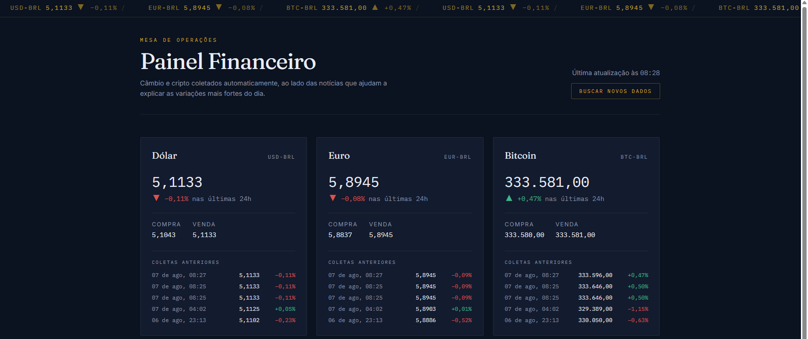
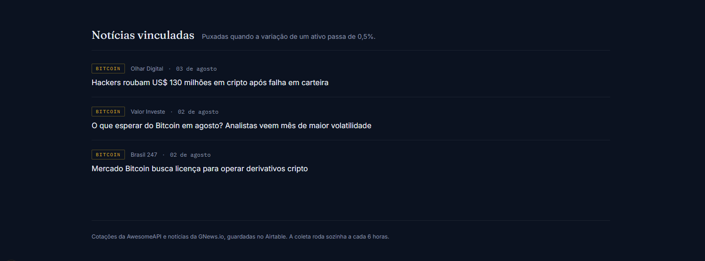
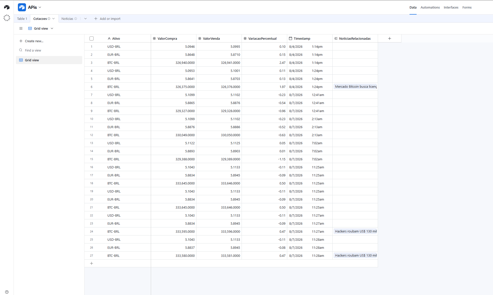

# Painel Financeiro — Cotações + Notícias

Trabalho da disciplina de Integração de APIs (UniFECAF).



## Descrição da solução

O Painel Financeiro é uma aplicação monolítica em Next.js (App Router) que acompanha três ativos — dólar, euro e bitcoin, todos cotados em real — e cruza a variação de cada um com as notícias publicadas no mesmo período. A cada ciclo de coleta a aplicação consulta a AwesomeAPI, normaliza o retorno e grava um registro novo na base do Airtable. O histórico nunca é sobrescrito: cada coleta é uma linha a mais, o que permite montar o mini-histórico exibido na interface.

A correlação com notícias é automática e condicional. Quando a variação percentual de um ativo passa de 0,5% em módulo, a aplicação consulta a GNews.io usando o nome do ativo em português ("dólar", "euro", "bitcoin"), pega as duas notícias mais recentes e as grava na tabela `Noticias`, vinculadas por registro à cotação que disparou a busca. Assim a base guarda não só o número, mas o contexto editorial do movimento — que é o que aparece no feed do dashboard, com um badge indicando a qual ativo cada notícia se refere. Matérias que já estão na base não são gravadas de novo: a checagem é por URL, e o registro existente apenas ganha mais um vínculo.

O backend e o frontend vivem no mesmo projeto, por decisão de arquitetura: os Route Handlers em `/app/api/*` rodam no servidor, o que elimina qualquer problema de CORS e mantém as credenciais do Airtable, da AwesomeAPI e da GNews 100% fora do navegador. O dashboard recebe a primeira carga já renderizada no servidor e busca as atualizações seguintes nas rotas `/api/cotacoes` e `/api/noticias`, que devolvem JSON limpo. A automação é disparada de fora por um workflow do GitHub Actions, que chama `/api/cron` periodicamente autenticando-se com um segredo compartilhado.

## APIs utilizadas

| API | Endpoint | Autenticação |
|---|---|---|
| AwesomeAPI (câmbio e cripto) | `https://economia.awesomeapi.com.br/json/last/USD-BRL,EUR-BRL,BTC-BRL` | API key opcional no header `x-api-key` (lida de `AWESOMEAPI_TOKEN`; sem ela a chamada é anônima e limitada por IP) |
| GNews.io (notícias) | `https://gnews.io/api/v4/search` | API key no query param `apikey` (lida de variável de ambiente, nunca exposta ao cliente) |
| Airtable (persistência) | `https://api.airtable.com/v0/{baseId}/{tabela}` | Personal Access Token no header `Authorization: Bearer` |

## Fluxo de integração

```
1. GET AwesomeAPI para a lista fixa de ativos: USD-BRL, EUR-BRL, BTC-BRL
2. Normalizar payload (a API retorna chaves tipo "USDBRL"; ajustar ao schema)
3. POST em Cotacoes (um registro novo por coleta, sem sobrescrever histórico)
4. Para cada ativo com |pctChange| > 0.5%:
   a. GET GNews.io com query = nome do ativo em português ("dólar", "bitcoin")
   b. Pegar até 2 resultados mais recentes
   c. Consultar Noticias pelas URLs devolvidas, para não gravar repetida
   d. POST em Noticias só para as URLs inéditas, linkando via AtivoRelacionado
      ao registro do passo 3. Nas já existentes, a cotação atual é acrescentada
      ao vínculo, sem apagar os anteriores
5. Retornar resumo da execução (ativos processados, notícias vinculadas e
   quantas dessas eram inéditas)
```

Todo esse fluxo roda dentro de `/app/api/cron/route.ts`, que valida o header `x-cron-secret` contra `CRON_SECRET` antes de executar qualquer coisa.

> **Sobre o limite de 0,5%:** o enunciado original fixava 1,5% como gatilho. Medindo as coletas reais, esse valor só é alcançado pelo bitcoin em dias atípicos — dólar e euro raramente passam de 0,6% —, o que mantinha o feed de notícias vazio quase sempre e deixava a automação sem nada a demonstrar. O limite foi calibrado para câmbio, onde meio por cento num único dia já é movimento real. O número está isolado na constante `LIMITE_VARIACAO` em `app/api/cron/route.ts`, então voltar a 1,5% é mudar uma linha.

> **Sobre notícias repetidas:** a GNews devolve as matérias mais recentes, e elas mudam devagar — a mesma URL reaparece ciclo após ciclo. Antes de gravar, o ciclo consulta a tabela `Noticias` pelas URLs retornadas: as que já existem são reaproveitadas e só as inéditas viram linha nova. Por isso o resumo separa `noticiasVinculadas` de `noticiasNovas`. Uma consequência visível na base: uma matéria que continua em destaque acumula vários vínculos em `AtivoRelacionado`, um para cada coleta em que apareceu.

O resultado no feed, com o badge do ativo, a fonte e a data de publicação de cada matéria:



### Tratamento de erros

- **AwesomeAPI falha:** o ciclo é abortado por inteiro e nada é gravado, para não deixar dados parciais na base.
- **AwesomeAPI recusa a credencial (401/403):** mesmo tratamento, com mensagem apontando `AWESOMEAPI_TOKEN` para não confundir chave inválida com instabilidade da API.
- **GNews falha para um ativo:** o ciclo segue para o próximo ativo. A cotação já foi gravada; a notícia é enriquecimento, não dado principal.
- **Airtable devolve 429 (rate limit):** uma nova tentativa após 2 segundos de espera.

## Schema do Airtable

Crie uma base com duas tabelas, exatamente com estes nomes e campos.

### `Cotacoes`

| Campo | Tipo |
|---|---|
| Ativo | Single line text |
| ValorCompra | Number (decimal) |
| ValorVenda | Number (decimal) |
| VariacaoPercentual | Number (decimal) |
| Timestamp | Date (com hora) |
| NoticiasRelacionadas | Link to another record → `Noticias` |

### `Noticias`

| Campo | Tipo |
|---|---|
| Titulo | Single line text |
| Fonte | Single line text |
| URL | URL |
| PublicadoEm | Date |
| AtivoRelacionado | Link to another record → `Cotacoes` |

> Os campos `NoticiasRelacionadas` e `AtivoRelacionado` devem ser as duas pontas do **mesmo** relacionamento (ao criar o link em uma tabela, o Airtable oferece criar o campo simétrico na outra).

A base populada por coletas reais. Cada linha é uma coleta — o histórico nunca é sobrescrito — e a coluna `NoticiasRelacionadas` só aparece preenchida nas linhas em que a variação passou do limite:



## Como executar

### 1. Instalar dependências

```bash
npm install
```

### 2. Configurar as variáveis de ambiente

Copie `.env.example` para `.env.local` e preencha:

```
AIRTABLE_PAT=        # Personal Access Token (scopes: data.records:read e data.records:write)
AIRTABLE_BASE_ID=    # ID da base, começa com "app", visível na URL
AWESOMEAPI_TOKEN=    # API key da AwesomeAPI (awesomeapi.com.br), enviada no header x-api-key
GNEWS_API_KEY=       # chave obtida em https://gnews.io/dashboard
CRON_SECRET=         # string aleatória longa, compartilhada com o GitHub Actions
```

`.env.local` está no `.gitignore` e não deve ser commitado em hipótese alguma.

Das cinco, só `AWESOMEAPI_TOKEN` é opcional: sem ela o client faz a chamada anônima, registra um aviso no log e continua funcionando — mas fica sujeito ao limite por IP, que é compartilhado em servidores de nuvem e devolve `429 QuotaExceeded` com facilidade. As outras quatro são obrigatórias.

### 3. Rodar em desenvolvimento

```bash
npm run dev
```

A aplicação sobe em `http://localhost:3000` e redireciona para `/dashboard`.

### 4. Disparar a coleta manualmente

```bash
curl -X POST http://localhost:3000/api/cron -H "x-cron-secret: SEU_CRON_SECRET"
```

Sem o header, ou com o valor errado, a rota devolve `401` e não executa nada. Com o header correto, ela devolve um resumo da execução:

```json
{
  "ok": true,
  "executadoEm": "2026-08-07T13:14:15.504Z",
  "ativosProcessados": 3,
  "ativosComVariacaoRelevante": 1,
  "noticiasVinculadas": 2,
  "noticiasNovas": 1,
  "detalhes": [ ... ]
}
```

`noticiasVinculadas` conta todas as notícias ligadas às cotações do ciclo; `noticiasNovas` diz quantas dessas foram gravadas agora — a diferença entre as duas é a deduplicação agindo. Cada item de `detalhes` traz o `cotacaoId` criado e, quando o enriquecimento falha, um campo `aviso` com o motivo.

Depois disso, recarregue `/dashboard` para ver os dados.

### 5. Configurar o cron no GitHub Actions

O workflow em [.github/workflows/cron.yml](.github/workflows/cron.yml) chama `/api/cron` a cada 6 horas (`0 */6 * * *`) e também pode ser disparado à mão pela aba **Actions → Coleta periodica de cotacoes → Run workflow**.

Em **Settings → Secrets and variables → Actions**, cadastre dois secrets no repositório:

| Secret | Valor |
|---|---|
| `APP_URL` | URL pública da aplicação, sem barra no final (ex.: `https://painel-financeiro.vercel.app`) |
| `CRON_SECRET` | o mesmo valor usado no `.env.local` e configurado no ambiente do deploy |

> O GitHub Actions só alcança a aplicação se ela estiver publicada em uma URL acessível pela internet — `localhost` não funciona. Para testar tudo localmente, use o `curl` do passo 4.

O agendamento é *best-effort*: nas execuções observadas, o job saiu de 40 a 60 minutos depois do horário nominal, e sob carga o GitHub pode pular uma janela inteira. A cadência real, portanto, não é cravada de 6 em 6 horas. Isso não afeta os dados — cada execução grava a cotação do instante em que rodou.

### 6. Variáveis de ambiente no ambiente publicado

O `.env.local` existe só na sua máquina: está no `.gitignore` e **não sobe junto com o código**. As mesmas cinco variáveis do passo 2 precisam ser cadastradas no painel do host onde a aplicação está publicada (Vercel, Render etc.), no ambiente de produção.

Três detalhes que custam tempo quando passam batido:

- **Variável nova só vale depois de um novo deploy.** Cadastrar sem redeployar não surte efeito.
- **`AWESOMEAPI_TOKEN` e `GNEWS_API_KEY` vão no host, não como secret do repositório.** Quem chama essas APIs é o servidor da aplicação; o GitHub Actions apenas faz `curl` no `/api/cron`. Secret de repositório é só para `APP_URL` e `CRON_SECRET`.
- **Falta de `GNEWS_API_KEY` não derruba o ciclo.** Por desenho, a falha de notícia é isolada por ativo: o job termina em 200 e fica **verde no Actions** mesmo vinculando zero notícias. Se o feed não estiver enchendo, abra o log da execução e leia o `resposta.json` — o campo `aviso` de cada ativo diz o que houve.

## Rotas disponíveis

| Rota | Método | Descrição |
|---|---|---|
| `/dashboard` | GET | Interface de consulta |
| `/api/cotacoes` | GET | Lista as cotações do Airtable (`?limite=30`) |
| `/api/noticias` | GET | Lista as notícias, já com o ativo resolvido (`?limite=20`) |
| `/api/cron` | GET/POST | Executa o ciclo de coleta. Exige o header `x-cron-secret` |

## Estrutura do projeto

```
/app
  /api
    /cron/route.ts          automação: coleta, persistência e correlação
    /cotacoes/route.ts      leitura das cotações para a interface
    /noticias/route.ts      leitura das notícias para a interface
  /dashboard
    page.tsx                carga inicial (server component)
    painel.tsx              interface (client component)
    ticker.tsx              faixa superior com scroll contínuo
    formato.ts              formatação de valores e datas
    tipos.ts                tipos da interface
  layout.tsx
  globals.css
/lib
  airtable.ts               leitura/escrita na base via REST API
  awesomeapi.ts             client da AwesomeAPI
  gnews.ts                  client da GNews
/.github/workflows/cron.yml agenda a chamada periódica ao /api/cron
```

## Stack

Next.js 15 (App Router) · TypeScript · Tailwind CSS · Airtable REST API · fetch nativo, sem SDKs.
